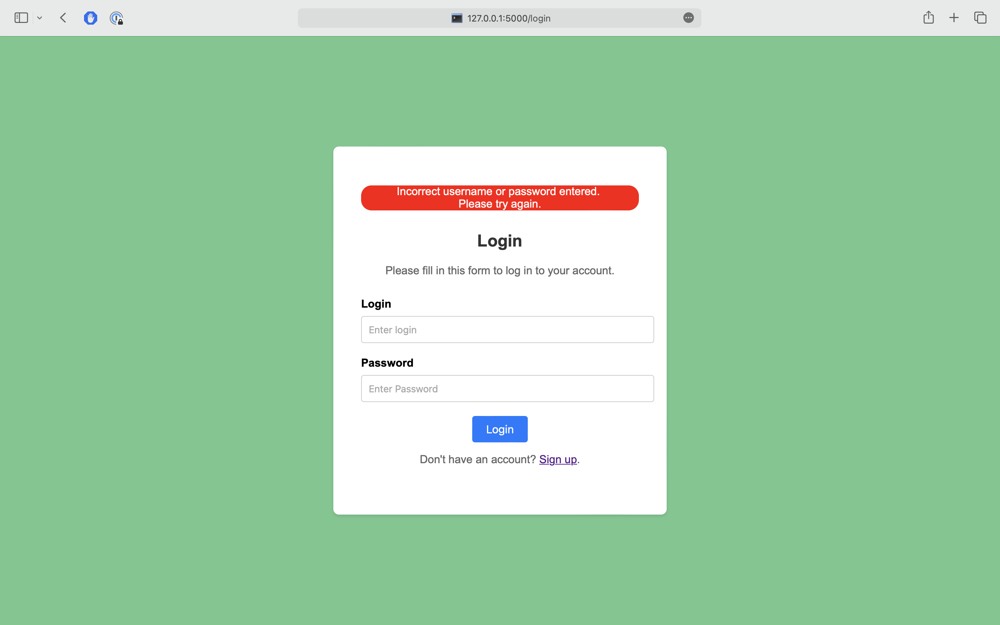
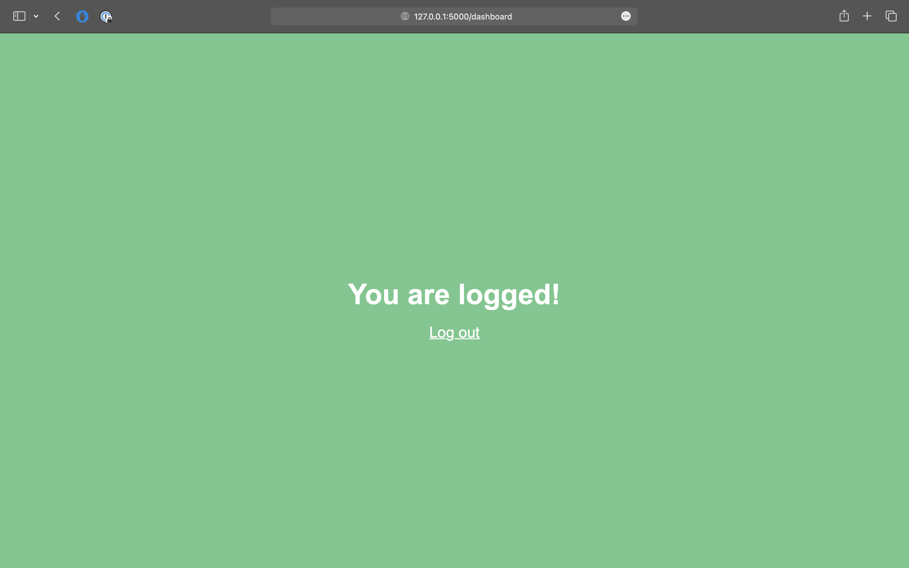

# Auth system

### Technologies used
1) Python 3.11
2) Flask
3) HTML and CSS
4) psycopg2
5) werkzeug

### Deployment 

1) Clone the repository
2) Open terminal 
3) Run `pip install -r requirements.txt`
4) Export virtual environment variables (DATABASE, USERNAME, PASSWORD, PORT, SECRET_KEY) - e.g. `export DATABASE="example"`
5) Run `python migrations/local_migration.py`
6) Run Flask server using `FLASK_APP=main`, `flask run` in terminal

### Photo examples

#### Start page

#### Login

#### Incorrect login 

#### Sign up

#### Dashboard
